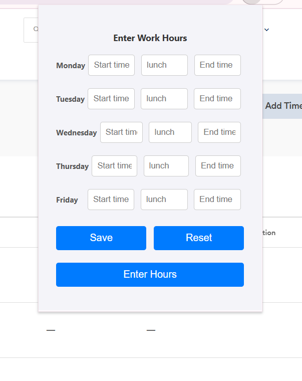
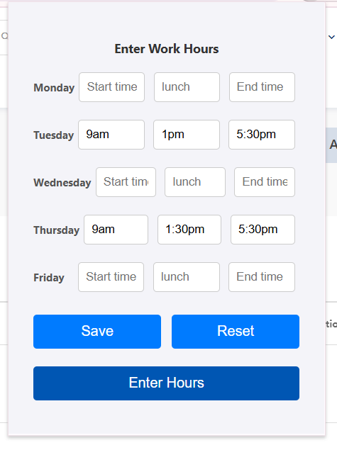
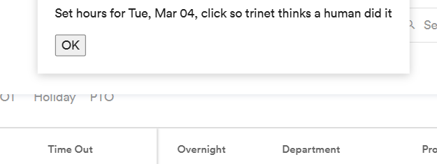

# Smart Timesheet Filler

A Chrome extension that automatically fills in work hours on TriNet timesheets, saving time and reducing repetitive data entry.

## Features

- Quick input of work hours through a simple popup interface
- Automatically fills all timesheet fields with the specified hours
- Works specifically with TriNet's timesheet system
- Clean and user-friendly interface

## Installation

1. Visit the [Chrome Web Store](https://chrome.google.com/webstore/detail/smart-timesheet-filler/your-extension-id)
2. Click "Add to Chrome"
3. Click "Add Extension" in the popup to confirm installation

## Usage Guide

### 1. Opening the Extension
Click the extension icon in your Chrome toolbar while on the TriNet timesheet page.

### 2. Entering Work Hours
In the popup interface:
- Input start time and end time for each day
- Lunch time input is optional - if you take a lunch break, only enter the start time (e.g., 12:00 PM)
  - The lunch duration is automatically calculated as 30 minutes
  - Leave it blank if you don't take a lunch break
- Leave the input blank if you don't work on that day
- Ensure that the times are entered in the correct format (e.g., 9:00 AM, 12:30 PM, 5:00 PM)

### 3. Managing Hours
- Click the "Save" button to save your hours
- Click the "Reset" button to clear all your input

### 4. Submitting Hours
Click the "Submit Hours" button to automatically fill in all timesheet fields.

### 5. Confirming Submission
After clicking "Submit Hours," a confirmation popup will appear with an "OK" button. You need to keep clicking "OK" continuously until all hours are filled.

> **Warning**: Do not spam click the OK button. Wait for each input to be filled before clicking OK again to ensure all hours are properly recorded.

### 6. Verifying and Managing Entries
After all hours are filled, you can verify the entries in the timesheet. If you need to delete an entry, use the delete button located on the right side of each entry.

> **Important Notes**:
> - This extension does not delete or overwrite existing input in TriNet
> - If you run the extension multiple times, it will add duplicate entries
> - You must manually delete any duplicate entries using the delete button
> - Always verify your entries before final submission

## Version

Current version: 1.0

## License

This project is proprietary and not licensed for redistribution.